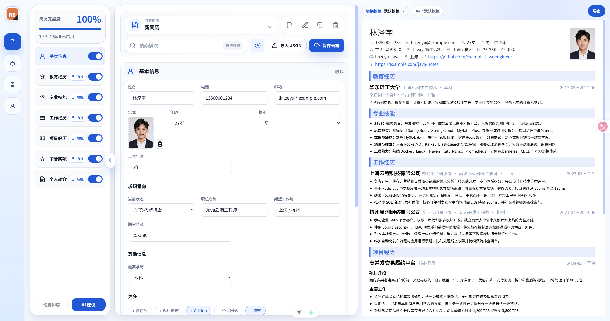
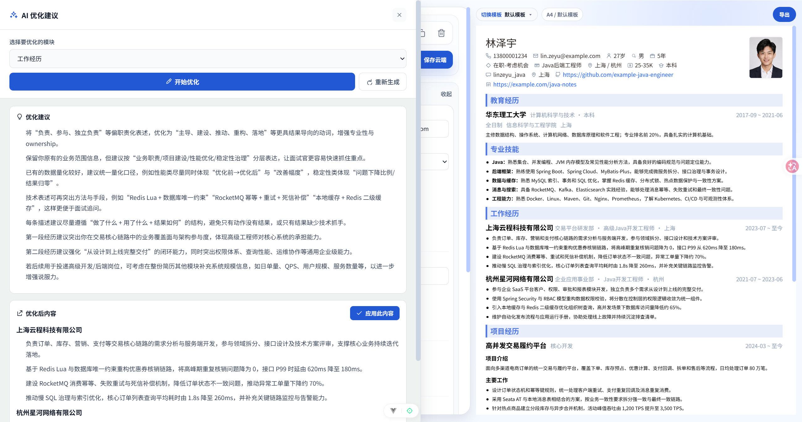
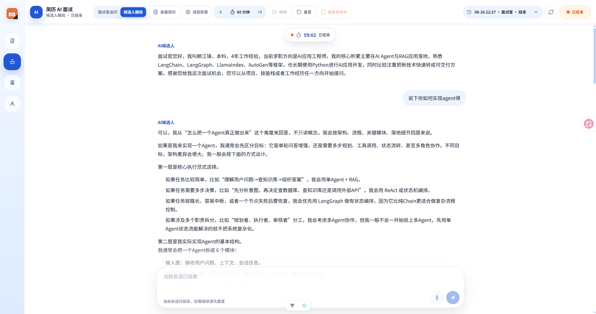
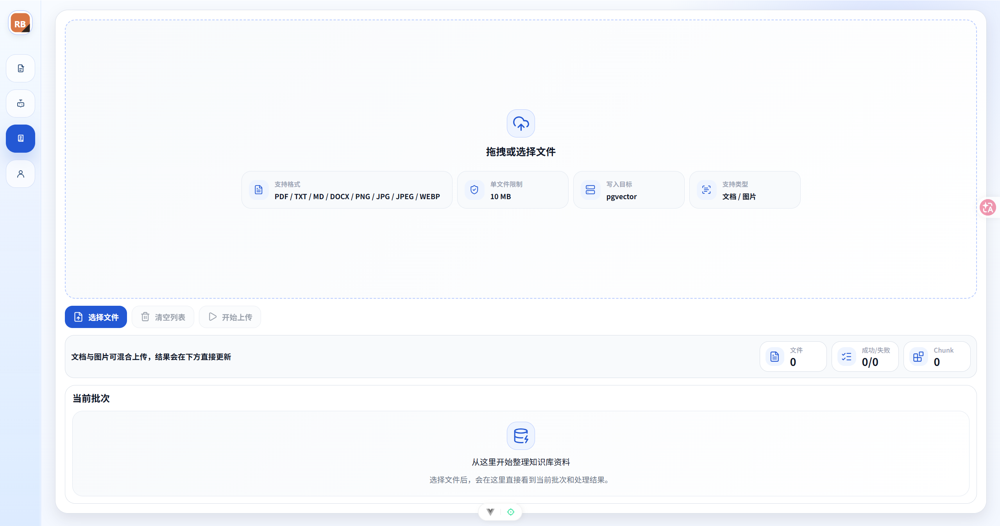

<!-- author: jf -->
# Resume Builder

一个面向求职场景的 AI 简历平台，支持简历编辑、模板切换、云端保存、AI 优化、AI 面试和 RAG 知识库。

项目提供 Spring AI 和 Python AI 两套后端，前端统一连接 `8999` 端口，开发时二选一启动。

## 核心功能

- 账号与权限：注册、加密登录、邮箱验证、密码重置、登录过期处理和角色权限控制。
- 简历管理：新建、切换、复制、重命名、删除、自动保存和手动保存。
- 简历编辑：模块编辑、显示隐藏、拖拽排序、实时预览和移动端适配。
- 模板与导出：内置 9 套模板，支持 PDF、Markdown、JSON 导出和 JSON 导入。
- 图片生成模板：发送模板图片和模板名称，通过 Skill 自动生成模板组件、完成注册并接入预览图。
- AI 优化：按简历模块生成优化建议和优化内容，并可直接应用。
- AI 面试：候选人模拟、面试官追问、语音输入、会话历史和结束评分。
- 知识库：上传文档或图片，经过 OCR、切块和 Embedding 后写入 pgvector。

## 页面截图

### 简历编辑



### AI 优化



### AI 面试



### 知识库



## 图片生成模板

在 Codex 中发送模板图片和模板名称，并说明：

> 使用 `resume-template-from-image` Skill，根据图片创建“模板名称”。

Skill 会自动生成模板组件、注册模板并创建预览图。详细规则见 [Skill 说明](.codex/skills/resume-template-from-image/SKILL.md)。

## 技术栈

| 模块 | 技术 |
| --- | --- |
| 前端 | Vue 3、TypeScript、Pinia、Vite、Tailwind CSS |
| Spring 后端 | Java 21、Spring Boot 3、Spring AI、MyBatis-Plus |
| Python 后端 | Python 3.11+、FastAPI、Uvicorn |
| 数据库 | MySQL、PostgreSQL、pgvector |
| AI | OpenAI-compatible Chat、Embedding、Vision OCR、Realtime |

## 中间件与数据库迁移

完整功能需要运行：

- MySQL 8.x：存储账号、简历和 AI 面试会话。
- PostgreSQL 17 + pgvector：存储 RAG 知识库向量。
- Ollama：仅在 `EMBEDDING_PROVIDER=ollama` 时需要。
- Flyway：由 Docker 临时容器执行，不需要单独安装。

数据库脚本按用途存放：

- `sql/bootstrap/`：手工建库。
- `sql/migrations/`：Flyway 版本迁移。
- `sql/seeds/`：仅供本地手工导入的演示数据。

Windows Docker 启动脚本和 CI/CD 会先执行全部待处理迁移，成功后才启动后端。生产迁移不会执行 `sql/seeds/`，详细规则见 [SQL 说明](sql/README.md)。

## 快速启动

### 环境要求

- Node.js `^20.19.0 || >=22.12.0`
- Docker Desktop
- Spring 后端：JDK 21、Maven 3.9+
- Python 后端：Python 3.11+、uv

### 1. 启动前端

```powershell
npm install
npm run dev
```

前端默认地址：`http://localhost:5173`

### 2. 启动一个后端

Spring AI：

```powershell
copy spring-ai-backend\.env.example spring-ai-backend\.env
.\start-spring-backend.bat
```

Python AI：

```powershell
copy python-ai-backend\.env.example python-ai-backend\.env
.\start-python-backend.bat
```

两套后端都使用 `8999` 端口，不要同时启动。首次运行前需要填写对应 `.env`，Python 后端还需要先安装依赖。

数据库初始化和后端配置见：

- [Spring AI 后端说明](spring-ai-backend/README.md)
- [Python AI 后端说明](python-ai-backend/README.md)

### Docker 启动

复制并填写 Docker 环境变量：

```powershell
copy .env.docker.example .env
```

二选一启动数据库和后端：

```powershell
.\start-docker-spring-ai.bat
# 或
.\start-docker-python-ai.bat
```

Docker 脚本不会启动前端，前端仍需单独执行 `npm run dev`。

停止 Docker 服务：

```powershell
.\stop-docker-stack.bat
```

## 常用命令

```powershell
npm run dev
npm run type-check
npm run lint
npm run build
```

## 工作流

仓库规范入口：

1. 读取 `AGENTS.md`。
2. 读取 `.workflow/specs/index.md`、`global.md` 和 `conventions.md`。
3. 再按任务读取对应专项 Spec。

任务按复杂度处理：

- 局部、低风险修改直接实现并验证。
- 新功能、跨模块、数据库、权限或高风险任务进入完整 Harness。
- 完整 Harness：Brainstorm → PRD → 可选 UI → Implement → Quality Gate → Submit / Review → Archive。

相关目录：

- `.workflow/specs/`：仓库规范。
- `.workflow/lifecycle-plugins.json`：生命周期插件注册表。
- `docs/requirements/`：完整 Harness 的需求文档。
- `.workflow/archive/`：完成任务的归档。

详细流程见 [Harness Engineering 工作流](docs/harness-engineering-workflow.md)。

## 目录结构

```text
resume-builder/
├─ src/                    前端源码
├─ spring-ai-backend/      Spring AI 后端
├─ python-ai-backend/      Python AI 后端
├─ sql/                    数据库脚本
├─ screenshots/            页面截图
├─ docs/                   项目文档
├─ .workflow/              工作流与规范
└─ start-*.bat             Windows 启动脚本
```
